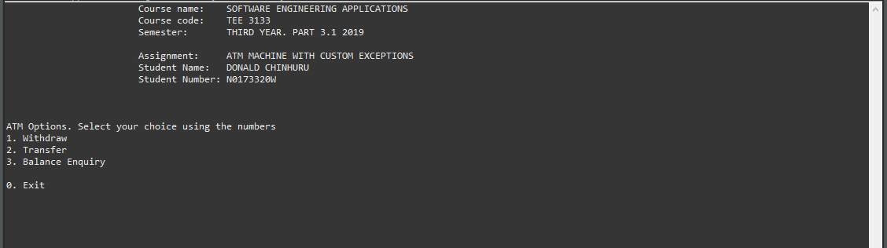
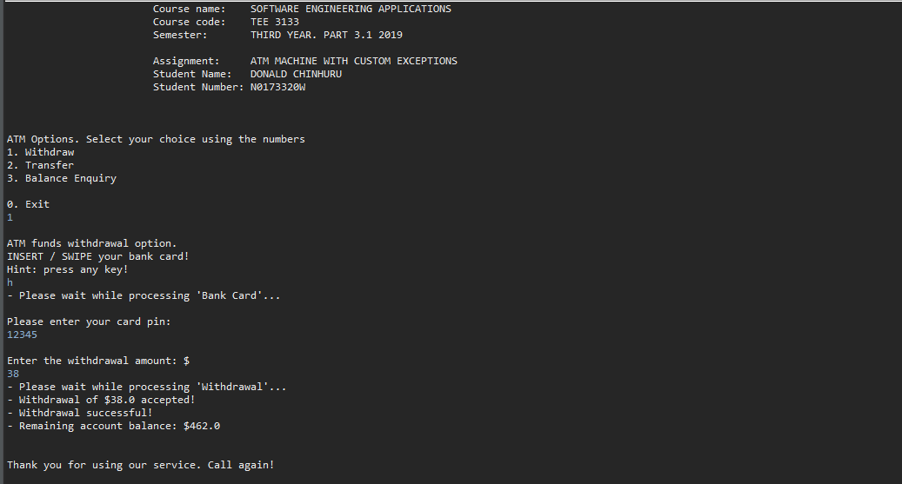

# Java ATM Machine - School Assignment Practise Project

```
@author:   Donald Chinhuru
@project:  ATM Machine
@aim:  	  Using Custom Exceptions

@created:  24 Oct 2019
@updated:  25 Oct 2019
```

## Program
- `Program` ___________ _Electronic Engineering_
- `Year` _______________ _Third Year 2019_

### Practise questions
- Simulate an ATM machine with custom exceptions

- dashboard
  

- withdrawal
